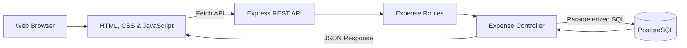

<div align="center">

# 💸 Expense Tracker

### A clean full-stack application for managing daily expenses

Build, organize, update, and track expenses through a responsive web interface powered by a RESTful API and PostgreSQL.

<p>
  <a href="https://drive.google.com/drive/folders/1KdqwQJRo5zoWXyXVRzJHkpEu3FJnKFaX?role=writer">
    
  </a>
</p>


[Overview](#-overview) •
[Features](#-features) •
[Installation](#-installation-and-setup) •
[API](#-api-reference) •
[Screenshots](#-api-testing-screenshots) •
[Drive](#-project-files)

</div>

---

## 📖 Overview

**Expense Tracker** is a lightweight full-stack application that demonstrates how a frontend interface communicates with a REST API to manage data stored in PostgreSQL.

Users can add new expenses, browse saved records, update their information, and delete records. The project follows a clear backend structure by separating routes, controllers, database configuration, and frontend files.

> This project is ideal for learning and demonstrating CRUD operations, asynchronous JavaScript, REST APIs, Express.js routing, and PostgreSQL integration.

## ✨ Features

| Feature | Description |
| --- | --- |
| 📋 View Expenses | Display all saved expenses in an organized table |
| ➕ Add Expense | Create an expense with a title, amount, category, and date |
| ✏️ Edit Expense | Load an existing expense and update its details |
| 🗑️ Delete Expense | Delete an expense after a confirmation message |
| ✅ Form Validation | Prevent empty fields and amounts less than or equal to zero |
| 💾 Persistent Storage | Store expense records permanently in PostgreSQL |
| 🔒 Safe Queries | Use parameterized SQL queries to reduce SQL injection risk |
| 🔄 RESTful API | Provide complete CRUD operations through standard HTTP methods |
| 📱 Responsive UI | Use Bootstrap to support different screen sizes |

## 🧰 Technology Stack

| Layer | Technologies |
| --- | --- |
| Frontend | HTML5, CSS3, JavaScript ES6+, Bootstrap 5, Fetch API |
| Backend | Node.js, Express.js, CORS, dotenv |
| Database | PostgreSQL, `pg` Node.js client |
| Development Tools | Visual Studio Code, Thunder Client or Postman, pgAdmin |

## 🏗️ Application Architecture



## 📁 Project Structure

```text
Pash_01/
├── config/
│   └── database.js              # PostgreSQL connection pool
├── controllers/
│   └── expenseController.js     # CRUD business logic
├── frontend/
│   ├── css/
│   │   └── style.css            # Custom styles
│   ├── js/
│   │   └── app.js               # Frontend logic and API requests
│   └── index.html               # Main user interface
├── photo_01/                    # API testing screenshots
├── routes/
│   └── expenseRoutes.js         # Expense API routes
├── .env.example                 # Environment variables template
├── database.sql                 # Table creation and sample data
├── package.json                 # Dependencies and scripts
├── schema.sql                   # Expenses table schema
└── server.js                    # Application entry point
```

## 🚀 Installation and Setup

### Prerequisites

Make sure these tools are installed:

- [Node.js](https://nodejs.org/)
- [PostgreSQL](https://www.postgresql.org/download/)
- [pgAdmin](https://www.pgadmin.org/download/) — recommended for database management
- Visual Studio Code with **Live Server** — optional

### 1. Download the Project

Download the files from Google Drive:

➡️ **[Open the Expense Tracker project on Google Drive](https://drive.google.com/drive/folders/1KdqwQJRo5zoWXyXVRzJHkpEu3FJnKFaX?role=writer)**

Then extract the project and open the `Pash_01` folder in Visual Studio Code.

### 2. Install Dependencies

Open the terminal inside the main project folder and run:

```bash
npm install
```

This installs:

- `express`
- `pg`
- `cors`
- `dotenv`

### 3. Create the PostgreSQL Database

Open pgAdmin and create a database that matches the value in `.env`:

```sql
CREATE DATABASE "expens_Tracker";
```

Open the Query Tool for the new database, then run `database.sql`.

The script creates the `expenses` table and inserts sample records. If you only want the empty table, run `schema.sql` instead.

### 4. Configure Environment Variables

Create a copy of `.env.example` and rename it to `.env`.

**Windows:**

```powershell
copy .env.example .env
```

**macOS or Linux:**

```bash
cp .env.example .env
```

Update the file using your PostgreSQL credentials:

```env
DB_USER=postgres
DB_HOST=localhost
DB_NAME=expens_Tracker
DB_PASSWORD=your_postgresql_password
DB_PORT=5432
PORT=3000
```

> Do not upload your real `.env` file or database password to a public repository.

### 5. Start the Backend

```bash
npm start
```

When the server starts successfully, the terminal will display:

```text
Server running on port 3000
```

The API base URL is:

```text
http://localhost:3000/api/expenses
```

### 6. Open the Frontend

Open `frontend/index.html` in the browser, or right-click it in Visual Studio Code and select **Open with Live Server**.

## 🔌 API Reference

Base URL:

```text
http://localhost:3000/api/expenses
```

| Method | Endpoint | Description | Success Status |
| --- | --- | --- | --- |
| `GET` | `/api/expenses` | Return all expenses | `200 OK` |
| `GET` | `/api/expenses/:id` | Return one expense by ID | `200 OK` |
| `POST` | `/api/expenses` | Create a new expense | `201 Created` |
| `PUT` | `/api/expenses/:id` | Update an expense | `200 OK` |
| `DELETE` | `/api/expenses/:id` | Delete an expense | `200 OK` |

### Example Request Body

Use this JSON body with `POST` and `PUT` requests:

```json
{
  "title": "Coffee",
  "amount": 3,
  "category": "Food",
  "date": "2026-09-26"
}
```

### Example Success Response

```json
{
  "id": 3,
  "title": "Coffee",
  "amount": "3.00",
  "category": "Food",
  "date": "2026-09-26T00:00:00.000Z"
}
```

### Example Error Response

```json
{
  "message": "Expense not found"
}
```

## 🗄️ Database Schema

### `expenses` Table

| Column | Data Type | Rules |
| --- | --- | --- |
| `id` | `SERIAL` | Primary key, auto-increment |
| `title` | `VARCHAR(100)` | Required |
| `amount` | `DECIMAL(10,2)` | Required |
| `category` | `VARCHAR(50)` | Required |
| `date` | `DATE` | Required |

```sql
CREATE TABLE expenses (
    id SERIAL PRIMARY KEY,
    title VARCHAR(100) NOT NULL,
    amount DECIMAL(10,2) NOT NULL,
    category VARCHAR(50) NOT NULL,
    date DATE NOT NULL
);
```

## 🧪 API Testing Screenshots

The API was tested using Thunder Client inside Visual Studio Code.

| Create Expense — `POST` | Update Expense — `PUT` |
| --- | --- |
|  |  |

| Delete Expense — `DELETE` | Not Found Response — `404` |
| --- | --- |
|  |  |

## 🛣️ Future Improvements

- [ ] Add user authentication and authorization.
- [ ] Add expense search and filtering.
- [ ] Add spending summaries by month and category.
- [ ] Display interactive charts and statistics.
- [ ] Add pagination for large numbers of expenses.
- [ ] Add stronger server-side validation.
- [ ] Add automated unit and integration tests.
- [ ] Deploy the frontend, backend, and database online.

## 📌 Project Files

All project files can be accessed through the following Google Drive folder:

### 🔗 [Click here to open the project on Google Drive](https://drive.google.com/drive/folders/1KdqwQJRo5zoWXyXVRzJHkpEu3FJnKFaX?role=writer)

## 👨‍💻 Author

**Tariq Bataineh**

Computer Science graduate and full-stack development enthusiast.

---

<div align="center">

### ⭐ If you find this project useful, consider giving it a star!

Made with ☕, JavaScript, and PostgreSQL.

</div>
